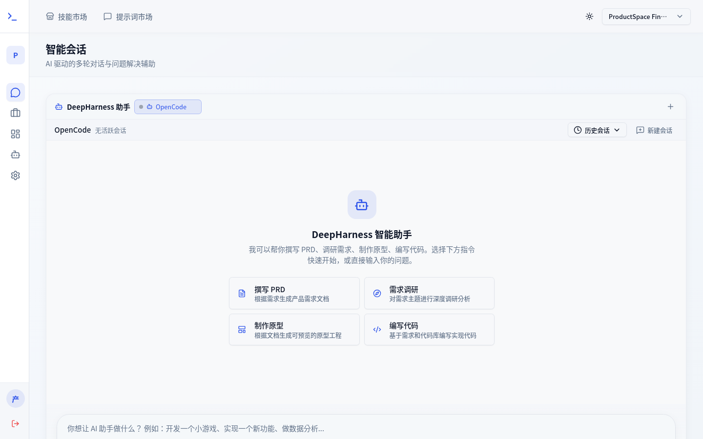
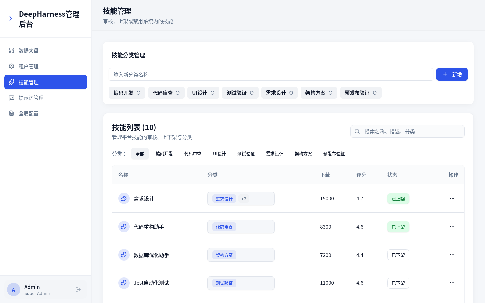
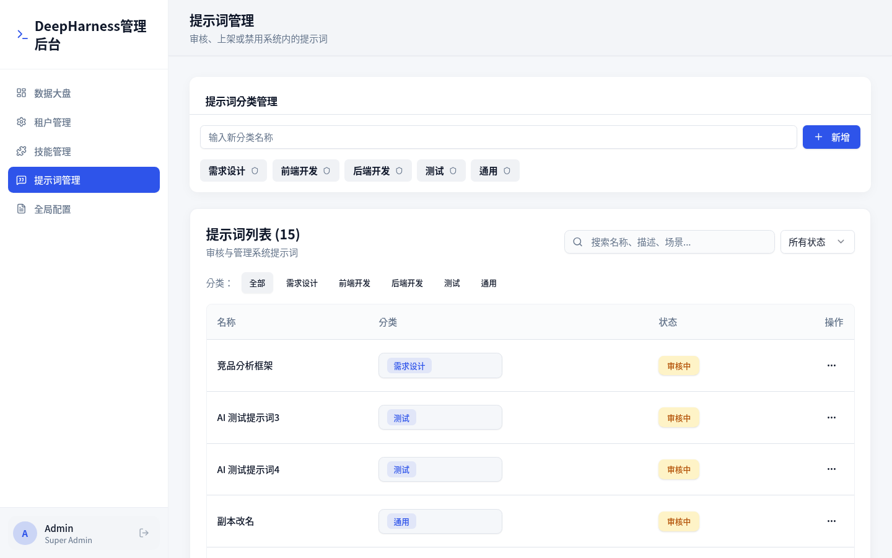

# DeepHarness Enterprise Platform

[中文](./README.md) | [日本語](./README.ja.md) | [Français](./README.fr.md)

A multi-tenant AI-assisted coding platform for development teams.

## Features

- **Multi-role intelligent chat**: supports product managers, developers, testers, and designers with slash commands, prompts, skills, code repositories, task cards, and `@doc` references as atomic input blocks
- **Product space**: product docs (Markdown three-mode editor + directory tree + version history + shared comments), requirements kanban, interactive prototypes, version history
- **Dev space**: code projects, code graph, smart review, smart testing, intelligent generation of coding/design standards (AGENTS.md / DESIGN.md)
- **Skill & prompt market**: market browsing, copy-to-use, super-admin review and category management, workspace custom prompts
- **Work item management**: full lifecycle of requirements, defects, and test cases, with integrations such as Jira / Meego / PingCode
- **Repository management**: Git repository configuration, clone/sync, user project directory mapping
- **Dashboard**: multi-dimensional statistics for skills, prompts, sessions, and work items
- **Reliable agent runtime**: AG-UI SSE event buffering, reconnect replay, crash recovery, multi-agent session orchestration

## Product Showcase

### Intelligent Chat



### Admin Skill Management



### Admin Prompt Management



## Architecture

```
.
├── apps/                          # Deployable applications
│   ├── dh-frontend/               # React + Vite + TypeScript frontend
│   ├── agent-runtime/             # Agent runtime wrapper (Rust target, currently Go stub)
│   ├── dh-backend/                # Unified DeepHarness backend (port 8080)
│   │   ├── config/                # Environment config loader
│   │   ├── constants/             # Global constants
│   │   ├── agent/                 # Agent client, chat, orchestrator
│   │   │   ├── agui/              # AG-UI protocol types and SSE buffer
│   │   │   │   └── buffer/        # SSEBuffer interface + memory/redis impl
│   │   │   ├── chat/              # Session/Message domain models and storage
│   │   │   ├── client/            # HTTP+SSE client to gatewayd
│   │   │   └── orchestrator/      # Agent session orchestration
│   │   ├── gateway/               # HTTP routes, handlers, middleware, server
│   │   │   ├── handler/           # AGUI, session, file, command handlers
│   │   │   ├── middleware/        # CORS, auth, request logging
│   │   │   └── server/            # Server assembly and route registration
│   │   ├── domain/                # Business domain modules
│   │   │   ├── identity/          # User authentication and management
│   │   │   ├── project/           # Project management
│   │   │   ├── workitem/          # Requirements, defects, test cases
│   │   │   ├── pragent/           # PR review agent
│   │   │   └── audit/             # Audit logging
│   │   └── tests/test-agent       # Agent Client local test tool
│   └── mock/                      # Local Agent SSE mock (independent module)
├── packages/                      # Shared libraries
│   ├── ui/                        # Shared React UI components
│   ├── api-types/                 # Shared API TypeScript types
│   ├── go-sdk/                    # Shared Go SDK (DDD domain + infrastructure abstractions)
│   │   ├── domain/                # Domain models (identity, project, workitem, agent, audit)
│   │   ├── infrastructure/        # Infrastructure abstractions (git, workitem-tracker, pr-agent, llm, postgres)
│   │   └── common/                # Common utilities
│   └── config/                    # Shared config (tsconfig, eslint presets)
├── infra/                         # Infrastructure code
│   ├── database/                  # Database migration scripts
│   ├── k8s/                       # Kubernetes manifests
│   ├── helm/                      # Helm charts
│   └── docker/                    # Dockerfiles and compose files
├── turbo.json                     # Turborepo configuration
├── pnpm-workspace.yaml            # pnpm workspaces
├── go.work                        # Go workspace
└── package.json                   # Root workspace
```

## Prerequisites

- [Node.js](https://nodejs.org/) (v20+)
- [pnpm](https://pnpm.io/) (v9.15.5)
- [Go](https://go.dev/) (v1.22+)

## Getting Started

Install dependencies:

```bash
pnpm install
```

Run all services in development mode:

```bash
pnpm dev
```

Or run individually:

```bash
# Frontend
pnpm --filter @repo/dh-frontend dev

# DH Backend
pnpm --filter @repo/dh-backend dev
```

## Build

Build all applications:

```bash
pnpm build
```

## Available Scripts

| Command | Description |
|---------|-------------|
| `pnpm dev` | Start all apps in development mode |
| `pnpm build` | Build all apps |
| `pnpm lint` | Lint all apps |
| `pnpm check-types` | Type-check all apps |
| `pnpm test` | Run all tests |

## Database (PostgreSQL)

This project uses **PostgreSQL 15** as the primary database.

Start a local PostgreSQL instance with Docker Compose:

```bash
docker compose -f infra/docker/compose.postgres.yml up -d
```

Default connection (used by Go services):

| Variable | Value |
|----------|-------|
| `DB_HOST` | `127.0.0.1` |
| `DB_PORT` | `5433` (host) / `5432` (container) |
| `DB_USER` | `deepharness` |
| `DB_PASSWORD` | `deepharness` |
| `DB_NAME` | `deepharness` |

Schema files are located in `infra/database/` and are automatically mounted into the PostgreSQL container on first startup.

`apps/dh-backend` gracefully falls back to in-memory mock data when `DB_HOST` is not set, so `pnpm dev` works without a running database.

## SSE Buffer (Event Cache & Crash Recovery)

The backend buffers AG-UI SSE events and run-level checkpoints to support:

1. **Frontend reconnection replay** — if the browser disconnects mid-run, buffered events are replayed on reconnect.
2. **Crash recovery** — if the server crashes mid-run, checkpointed run state (reasoning / text / tool-call parts) is persisted as a completed assistant message on the next session history load.

## Technologies

- **Frontend**: React 18, Vite, TypeScript, Tailwind CSS, shadcn/ui
- **Backend**: Go 1.22, standard library `net/http`, unified `dh-backend` module
- **Database**: PostgreSQL 15
- **Cache/Buffer**: Redis (optional, for SSE event cache and crash recovery)
- **Monorepo**: Turborepo, pnpm workspaces, Go workspaces
